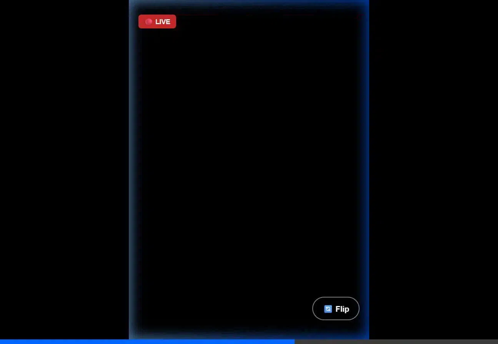
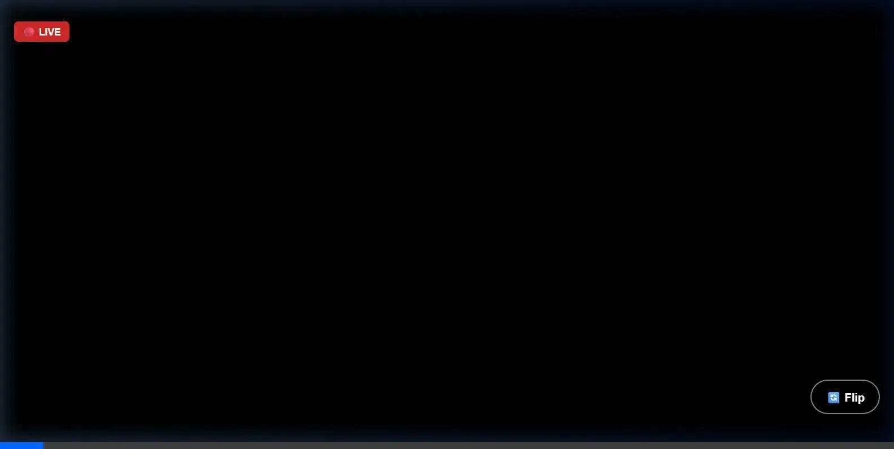

# MCX Cam App

## 🧠 Overview

**MCX Cam App** is a fast, low-latency, peer-to-peer video streaming application built primarily to turn any mobile device into a live webcam feed viewable on a secondary network device (like a laptop or tablet). 

By using **WebRTC** to stream the video securely between devices and a lightweight **FastAPI WebSocket** server solely for establishing the initial connection, the video data routes directly and locally over your WiFi network. This ensures high privacy, no lag, and zero external cloud video processing.

### ✨ Key Application Features
* **Seamless P2P Video Streaming:** Direct browser-to-browser connection using bare-metal WebRTC logic for maximum performance.
* **Dynamic Camera Switching:** Effortlessly flip between the front and rear ("environment") cameras on the sender device without dropping the active WebRTC track or reloading the page.
* **iOS & Strict Browser Optimization:** Specifically engineered to bypass aggressive browser restrictions by enforcing secure SSL contexts locally and managing strict HTML5 video autoplay policies.
* **Connection State Management:** Built-in connection queue prevents stream hijacking; if a sender is already active, new devices attempting to broadcast are placed into a "Wait" state.
* **Clean, Immersive UI:** A full-screen, scroll-locked interface featuring a dynamic floating flip button, a built-in `🔴 Live` badge, and clean connection status overlays.

---

## 📸 Application Demo

| Mobile Sender (Broadcaster) | Desktop Viewer (Watcher) |
|:---:|:---:|
|  |  |

*(Animated recordings capturing the live WebRTC interface)*

---

## 🏗️ High-Level Architecture

```
[Mobile Browser (Sender)]
    │
    │ getUserMedia (camera)
    ▼
[WebRTC Peer Connection]
    │
    │ (Signaling via WebSocket)
    ▼
[FastAPI Signaling Server]
    ▲
    │
[WebRTC Peer Connection]
    ▲
    │
[Laptop Browser (Viewer)]
```

---

## 🔑 Core Technologies

### 1. WebRTC

* Peer-to-peer video streaming
* Low latency
* Browser native

### 2. FastAPI

* Used ONLY for signaling
* No video processing

### 3. WebSocket

* Exchanges signaling messages:

  * SDP Offer
  * SDP Answer
  * ICE Candidates

### 4. getUserMedia API

* Access mobile camera from browser

---

## 📁 Project Structure

```text
project-root/
│
├── app/
│   ├── router.py             # API and page routes
│   ├── sender/               # Sender (Broadcaster) Module
│   │   ├── sender.html
│   │   ├── sender.js
│   │   └── sender.py
│   ├── viewer/               # Viewer (Watcher) Module
│   │   ├── viewer.html
│   │   ├── viewer.js
│   │   └── viewer.py
│   └── ws/                   # WebSocket Module
│       └── manager.py        
│
├── cert.pem                  # Generated SSL cert (Git ignored)
├── key.pem                   # Generated SSL key (Git ignored)
├── generate_cert.py          # Script to generate local SSL certs 
├── main.py                   # FastAPI Application Entrypoint
├── requirements.txt          # Python dependencies
├── .gitignore                # Git ignore configuration
└── README.md                 # Project Documentation
```

---

## ⚙️ Backend (FastAPI Signaling Server)

### Responsibilities

* Maintain WebSocket connections
* Relay messages between peers

### Implementation

```python
from fastapi import FastAPI, WebSocket

app = FastAPI()
clients = []

@app.websocket("/ws")
async def websocket_endpoint(websocket: WebSocket):
    await websocket.accept()
    clients.append(websocket)
    try:
        while True:
            data = await websocket.receive_text()
            for client in clients:
                if client != websocket:
                    await client.send_text(data)
    except:
        clients.remove(websocket)
```

---

## 📱 Sender (Mobile Browser)

### Responsibilities

* Access camera
* Create WebRTC connection
* Send stream

### Key Steps

1. Access camera

```javascript
const stream = await navigator.mediaDevices.getUserMedia({ video: true, audio: false });
video.srcObject = stream;
```

2. Create PeerConnection

```javascript
const pc = new RTCPeerConnection({
  iceServers: [{ urls: "stun:stun.l.google.com:19302" }]
});
```

3. Add tracks

```javascript
stream.getTracks().forEach(track => pc.addTrack(track, stream));
```

4. Create offer

```javascript
const offer = await pc.createOffer();
await pc.setLocalDescription(offer);
ws.send(JSON.stringify({ type: "offer", data: offer }));
```

---

## 💻 Viewer (Laptop Browser)

### Responsibilities

* Receive stream
* Display video

### Key Steps

1. Create PeerConnection

```javascript
const pc = new RTCPeerConnection({
  iceServers: [{ urls: "stun:stun.l.google.com:19302" }]
});
```

2. Receive stream

```javascript
pc.ontrack = (event) => {
  video.srcObject = event.streams[0];
};
```

3. Handle offer

```javascript
await pc.setRemoteDescription(offer);
const answer = await pc.createAnswer();
await pc.setLocalDescription(answer);
ws.send(JSON.stringify({ type: "answer", data: answer }));
```

---

## 🔄 Signaling Flow

1. Sender creates **Offer** → sends via WebSocket
2. Viewer receives Offer → creates **Answer**
3. Viewer sends Answer → Sender receives
4. Both exchange **ICE candidates**
5. Direct WebRTC connection established

---

## 🚀 Setup & Installation

### 1. Create a Virtual Environment (Optional but Recommended)
```powershell
python -m venv .venv
# On Windows:
.venv\Scripts\Activate.ps1
# On Mac/Linux:
source .venv/bin/activate
```

### 2. Install Dependencies
```powershell
pip install -r requirements.txt
pip install cryptography  # Used for local self-signed certificates
```

---

## 🔐 Generating Local SSL Certificates (For iOS Testing)

Because iOS permanently blocks the camera over standard `http://` on local networks, you need to generate a self-signed SSL Certificate specifically designed for your IP address.

Run the certificate generator:
```powershell
python generate_cert.py
```
> **Note:** If your computer gets a new IP assigned to it, you may need to edit `ip_addr` in `generate_cert.py` and run it again to get a fresh certificate.

---

## 🌐 Network Setup & Running the Server

Once you have your `key.pem` and `cert.pem`, start the Uvicorn ASGI server with SSL enabled:

```powershell
uvicorn main:app --host 0.0.0.0 --port 8000 --ssl-keyfile key.pem --ssl-certfile cert.pem
```

*(The `main.py` is configured to intelligently serve the HTML pages automatically without breaking).*

### Accessing the Endpoints

If your server IP was `192.168.220.37` (replace with your actual local IP):

* **The Sender App:** `https://<YOUR_LOCAL_IP>:8000/sender.html`
* **The Viewer App:** `https://<YOUR_LOCAL_IP>:8000/viewer.html`

> **Note:** When initially visiting your own `https://` endpoint, your browser will warn you the connection is "Not Private" because it's a self-signed local certificate. Click **"Advanced -> Proceed"** or **"Show Details -> Visit this website"** to securely access your stream.

---

## ⚠️ Edge Cases & Considerations

### 1. Camera Permissions

* Must be allowed in browser
* Requires secure context (HTTPS or local IP)

### 2. Network Issues

* Both devices must be on same WiFi
* Firewall should allow port access

### 3. ICE Failure

* Add STUN server (already included)
* For strict networks, TURN may be needed

### 4. Multiple Viewers

* Current setup is 1-to-1
* For multiple viewers:

  * Use SFU (Selective Forwarding Unit)

### 5. Mobile Compatibility

* Works best in Chrome
* Safari may require HTTPS

### 6. Performance

* WebRTC is efficient
* Avoid sending raw frames manually

---

## 🚀 Future Enhancements

* Multi-user broadcasting
* Audio streaming
* Camera switching (front/back)
* Recording streams
* QR code for quick connection
* Authentication

---

## 📦 Building a Standalone `.exe` (Windows)

You can package the entire MCX Cam App into a **single portable `.exe` file** using PyInstaller. No Python installation is required on the target machine.

### 1. Install PyInstaller

Make sure your virtual environment is active, then run:

```powershell
pip install pyinstaller
```

### 2. Build the Executable

From the project root, run:

```powershell
pyinstaller --name "MCX_Cam_Server" --onefile --console `
  --add-data "app;app" `
  --hidden-import "uvicorn.logging" `
  --hidden-import "uvicorn.loops" `
  --hidden-import "uvicorn.loops.auto" `
  --hidden-import "uvicorn.protocols" `
  --hidden-import "uvicorn.protocols.http" `
  --hidden-import "uvicorn.protocols.http.auto" `
  --hidden-import "uvicorn.protocols.websockets" `
  --hidden-import "uvicorn.protocols.websockets.auto" `
  --hidden-import "uvicorn.lifespan" `
  --hidden-import "uvicorn.lifespan.on" `
  --hidden-import "cryptography" `
  --hidden-import "fastapi" `
  --hidden-import "starlette" `
  run.py
```

```powershell
.venv\Scripts\pyinstaller --name "MCX_Cam" --onefile --windowed `
  --add-data "app;app" `
  --hidden-import "uvicorn.logging" `
  --hidden-import "uvicorn.loops" `
  --hidden-import "uvicorn.loops.auto" `
  --hidden-import "uvicorn.protocols" `
  --hidden-import "uvicorn.protocols.http" `
  --hidden-import "uvicorn.protocols.http.auto" `
  --hidden-import "uvicorn.protocols.websockets" `
  --hidden-import "uvicorn.protocols.websockets.auto" `
  --hidden-import "uvicorn.lifespan" `
  --hidden-import "uvicorn.lifespan.on" `
  --hidden-import "cryptography" `
  --hidden-import "fastapi" `
  --hidden-import "starlette" `
  --hidden-import "customtkinter" `
  gui.py
```

The output will be at: **`dist\MCX_Cam_Server.exe`** (~19 MB)

---

## 🖥️ How to Use `MCX_Cam_Server.exe`

### Step 1 — Copy the `.exe`

Place `MCX_Cam_Server.exe` anywhere on your Windows machine (e.g. Desktop or any user folder).

> ⚠️ **Do NOT place it inside `Program Files`** — it needs write access to that folder to generate the SSL certificate files.

### Step 2 — Run It

Double-click the `.exe`, or launch it from a terminal:

```powershell
.\MCX_Cam_Server.exe
```

### Step 3 — What Happens Automatically

On **first launch**, the app will:
1. 🔐 Detect that `key.pem` / `cert.pem` are missing
2. Auto-detect your machine's **local IP address**
3. Generate a **self-signed SSL certificate** valid for 365 days
4. Start the HTTPS server on port `8000`

On **subsequent launches**, it skips the certificate generation and starts the server immediately.

### Step 4 — Open the App

The console will display your exact URLs:

```
=======================================================
  🎥  MCX Cam — Local Network Camera App
=======================================================
  📱 Sender (Mobile) : https://192.168.x.x:8000/sender.html
  💻 Viewer (Desktop): https://192.168.x.x:8000/viewer.html

  ⚠️  On first visit, click 'Advanced → Proceed'
     to bypass the self-signed cert warning.
=======================================================
```

* Open the **Sender** URL on your mobile device (must be on same WiFi)
* Open the **Viewer** URL on your laptop or secondary device

### Step 5 — Trust the Certificate (One Time Only)

Since the cert is self-signed, your browser will show a security warning on the **first visit**:

| Browser | Steps |
|---|---|
| **Chrome** | Click `Advanced` → `Proceed to <IP> (unsafe)` |
| **Safari (iOS)** | Tap `Show Details` → `Visit this website` → `Visit website` |
| **Firefox** | Click `Advanced...` → `Accept the Risk and Continue` |

After accepting, the camera and stream will work normally. You'll only need to do this once per device per certificate.

### ♻️ Regenerating the Certificate

If your **computer's IP address changes** (e.g. after reconnecting to WiFi), the old certificate will no longer work for that IP. To regenerate:

1. Delete `key.pem` and `cert.pem` from the same folder as the `.exe`
2. Re-run `MCX_Cam_Server.exe` — it will auto-generate fresh certificates for the new IP

---

## ✅ Summary

This system:

* Uses **WebRTC for real-time streaming**
* Uses **FastAPI only for signaling**
* Works fully inside a **local network**

This architecture is lightweight, scalable, and suitable for real-time applications.

---

## 📌 Instructions for Coding Agents

* Implement backend signaling first
* Build minimal sender/viewer pages
* Ensure WebSocket message format consistency
* Test on same WiFi network
* Add ICE handling carefully
* Start with single peer connection before scaling

---

END OF DOCUMENT
